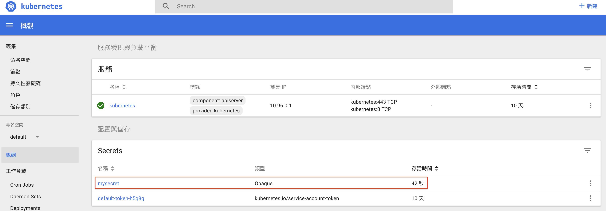

## 使用 secret 保護資訊

### 建立 `secret.yaml`
首先建立一個 secret 的檔案裡面存放著所有資訊(key:value)，使用 yaml 的方式部署 Secret 請先將內容編碼 (base64) 後再填入 yaml 檔

```yaml
# secret.yaml

---
apiVersion: v1
kind: Secret
metadata:
  name: mysecret
type: Opaque
data:
  NODE_ENV: cHJvZHVjdGlvbg==    # 這裡要記得使用 base64 編碼後的資料

```

可以在終端機上直接將字串使用 base64 編碼
```bash
$ echo -n "production" | base64
```


建立好之後就能先將他部署到 k8s 中
```bash
$ kubectl apply -f secret.yaml
```



### 建立一個 secret pod
使用 Volume 掛載到 Pod 中使用。

```yaml
apiVersion: v1   # 使用 v1 版本的 api
kind: Pod        # 類型為 Pod
metadata:        
  name: demo-pod      # Pod 的名稱
  labels:        # Pod 的標記
    app: webserver
spec:                # 其他規格描述
  containers:        # 描述容器內容
  - name: docker-nodejs-tutorial   # 將容器名稱
    image: andy6804tw/docker-nodejs-tutorial     # 使用自己 Docker Hub 範例映像檔
    ports:
    - containerPort: 8080   # 指定使用 8080 port
    volumeMounts:
    - mountPath: /tmp/conf # 將綁定 mysecret 的 Volume 掛載到 /tmp/conf 目錄下
      name: secret-volume
    env:                    # 將綁定的 mysecret 以環境變數的方式掛載
    - name: NODE_ENV    
      valueFrom:
        secretKeyRef:
          name: mysecret   
          key: NODE_ENV     # 指定綁定哪個 key
  volumes:
  - name: secret-volume   
    secret:
      secretName: mysecret   # 指定使用名為 mysecret 的 Secret 物件
```

完成後將 pod 部署到 k8s 中。

```bash
$ kubectl apply -f secret.pod.yaml
```


### 檢查環境變數
進入 bash 中查看

```bash
$ kubectl exec -it demo-pod bash

$ env | grep NODE_ENV 
```

- 避免敏感資料被任意讀取
- 可由管理者統一管理
- 可重複使用


### 揭露 Service
這邊使用指令快速揭露 Service，Pod 中的 Container 雖然已經運行了，但外部的使用者並不能訪問到，因此接下來要 Expose Service。

```bash
$ kubectl expose pod demo-pod --type=LoadBalancer    
```

查看外部ip
```$ 
kubectl get service 
```

查詢目前ip
```bash
$  minikube ip 
```

查看 log 檢查環境涮是否成功掛載
```bbash
$ kubectl logs demo-pod
```
