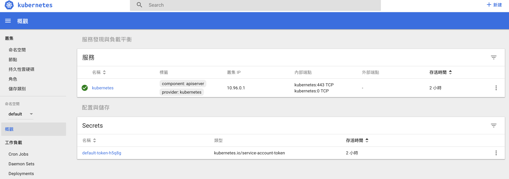

## 運行 minikube
啟動 k8s 叢集:

```bash
$ minikube start
```

首次啟動會下載IOS映像檔需要花比較多時間

## minikube 常用指令
### 檢查 minikube 版本
```bash
$ minikube version
```

### 檢查 minikube 狀態
```bash
$ minikube status
```

### 取得運行 ip
```bash
$ minikube ip
```

### 進入 SSH 連線
透過 SSH 的方式進入 bash 模式：
```bash
$ minikube ssh
```

k8s 使用 Docker 當作預設的容器環境，所以可以在裡面執行 Docker 指令。

### 開起監控介面

兩種方式開啟 Dashboard
1. 
```bash
$ minikube dashboard
```

2. 
```bash
kubectl proxy # 接著打開瀏覽器輸入 http://127.0.0.1:8001/ui
```



### 刪除 k8s 叢集
執行此指令會把 k8s 叢集刪除，而下次啟動 minikube 會重新建立叢集。
```bash
$ minikube delete
```

## 停止 minikube
```bash
$ minikube stop
```
