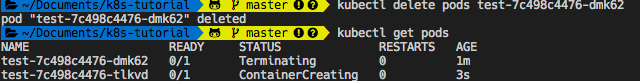

# kubectl 常用指令

### 取得設定檔
此指令列出 kubectl 的設定內容，可以得知 kubectl 已連接到 minikube。
```bash
$ kubectl config view
```

### 部署一個 Docker Image
```bash
$ kubectl run [App Name] --image=[Docker Image]  
# 範例 kubectl run test --image=andy6804tw/docker-nodejs-tutorial
```

### 查詢有哪些叢集

```bash
kubectl config get-contexts
```

### 切換到其他叢集

```bash
$ kubectl config use-context [NAME]
```

### 查詢目前正在管理的叢集

```bash
$ kubectl config current-context
```

### 取得叢集狀態

```bash
$ kubectl cluster-info
```

### 與 k8s 溝通

```bash
$ kubectl proxy # 接著打開瀏覽器輸入 http://127.0.0.1:8001/ui
```

#### 查詢有哪些 APIs 
```bash
$ curl http://localhost:8001
```

### 建立命名空間
```bash
$ kubectl create namespace [name]
```

### 查詢所有命名空間
```bash
$ kubectl get namespace
```

### 查詢目前命名空間內的 pod
```bash
$ kubectl get pods
```

### 查詢其他命名空間的 pod
```bash
$ kubectl get pods --namespace=kube-system
```

- 如果未指定命名空間 (namespace)，則預設會查詢 default 這個命名空間
- 預設會有 default、kube-public、kube-system 三個命名空間

### 刪除資源
```bash
$ kubectl delete [resources][namespace]
```
刪除某資源你會發現 k8s 會自動幫你重啟容器！


