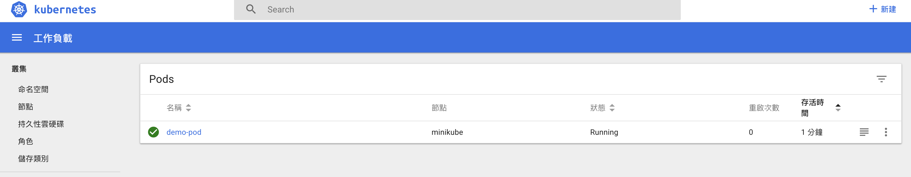

## Pod
Pod 為 k8s 中最小的單位，由一或多個容器(container)所組成，同一個 Pod 會共享網路與儲存空間，所以簡單來說一個 Pod 裡面可以包含一個或多個 Docker Container，而每個 Pod 都有屬於自己的 yaml 檔，此外在同一個 Pod 裡面的 containers 可以互相溝通。

## 建立第一個 Pod 物件

```yaml
# pod.yaml
---
apiVersion: v1   # 使用 v1 版本的 api
kind: Pod        # 類型為 Pod
metadata:        
  name: demo-pod      # Pod 的名稱
  labels:        # Pod 的標記
    app: webserver
spec:                # 其他規格描述
  containers:        # 描述容器內容
  - name: docker-nodejs-tutorial   # 將容器名稱
    image: andy6804tw/docker-nodejs-tutorial     # 使用自己 Docker Hub 範例映像檔
    ports:
    - containerPort: 8080   # 指定使用 8080 port
    env:                    # 環境變數
    - name: NODE_ENV
      value: "production"
```

## 利用 kubectl 部署 yaml 檔
`yaml` 設定完畢後就可以來部署第一個 Pod 了，這邊使用 kubectl 來和 k8s API 來進行建立部署：

```bash
$ kubectl create -f pod.yaml 
```

部署完畢後進入 dashboard 即可看到剛剛所部署的 Pod：

```bash
$ minikube dashboard
```




## 部署 Docker Image
kubectl run demo-pod2 --image=andy6804tw/docker-nodejs-tutorial --port=8080

## 揭露 Service
Pod 中的 Container 雖然已經運行了，但外部的使用者並不能訪問到，因此接下來要 Expose Service。

```bash
$ kubectl expose deployment demo-pod2 --type=LoadBalancer    
```

查看外部ip
```$ 
kubectl get service 

NAME         TYPE           CLUSTER-IP      EXTERNAL-IP   PORT(S)          AGE
demo-pod2    LoadBalancer   10.107.11.221   <pending>     8080:30952/TCP   4s
kubernetes   ClusterIP      10.96.0.1       <none>        443/TCP          1d
```

查詢目前ip
```bash
$  minikube ip 
```

kubectl logs30952  執行


## 查看 log
查看log的環境變數是否不一樣

```bash
$ kubectl logs [pod名稱]
```


https://medium.com/platformer-blog/getting-started-with-kubernetes-deploy-a-docker-container-with-kubernetes-in-5-minutes-eb4be0e96370
