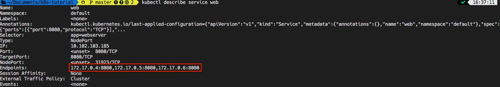

## Service
Service 物件利用 Label 與 Selector 來決定如何存取 (policy) 以及可以存取哪些 Pod。

首先建立的一個名為 web 的 Service 物件，再讓 k8s 提供一個端口能夠讓 k8s 外的使用者能夠連接到內部的 Pod。

```yaml
# service.yaml

---
apiVersion: v1
kind: Service
metadata:
  name: web
spec:
  type: NodePort
  selector:
    app: webserver      # 指定 Service 綁定 Label 有 app: webserver 的 Pod
  ports:
    - protocol: TCP
      port: 8080
```

## 部署 Service 到 k8s

```bash
kubectl apply -f service.yaml  
```

再透過指令查看 Service
```bash
$ kubectl get services
NAME         TYPE        CLUSTER-IP     EXTERNAL-IP   PORT(S)          AGE
kubernetes   ClusterIP   10.96.0.1      <none>        443/TCP          1d
web          NodePort    10.107.99.24   <none>        8080:31478/TCP   52s
```


## 刪除所有 Deployment
```bash
$ kubectl delete --all deployments --namespace=default
```

## 刪除所有 Pod
```bash
$ kubectl delete --all pods --namespace=default
```

## 刪除某 Service
```bash
$ kubectl delete service web
```


-------
重新來過

## 部署 Development

```bash
$ kubectl apply -f deployment.yaml
```

## 部署 Service 到 k8s

```bash
kubectl apply -f service.yaml  
```

輸入 `kubectl describe service web ` 查看詳細資訊可以發現 `Endpoints` 指向了三個 Pod 


